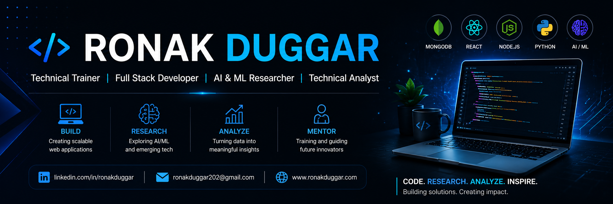

  

# Hi, I'm Ronak Duggar 👋

### Technical Trainer | Full Stack Developer | AI & ML Researcher | Technical Analyst

Passionate about building scalable web applications, conducting AI-driven research, and mentoring aspiring developers. I enjoy transforming innovative ideas into impactful solutions through technology, research, and continuous learning.

## 🚀 Tech Stack

**Frontend:** HTML • CSS • JavaScript • React • Next.js • Bootstrap

**Backend:** Node.js • Express.js • REST APIs

**Database:** MongoDB • MySQL

**Languages:** Java • Python • C

**Tools:** Git • GitHub • VS Code • Postman • Docker • Linux

## 🌱 Currently Exploring

- Agentic AI
- Generative AI & LLMs
- Advanced MERN Stack
- Cloud Computing
- System Design

## 📫 Connect with Me

- 🌐 Portfolio: **www.ronakduggar.com**
- 💼 LinkedIn: **[linkedin.com/in/ronakduggar](https://www.linkedin.com/in/ronakduggar/)**
- 📧 Email: **ronakduggar202@gmail.com**

---

> *Code • Research • Analyze • Inspire* 🚀

<!-- 

  
  

 -->
<!-- 

  

 -->
